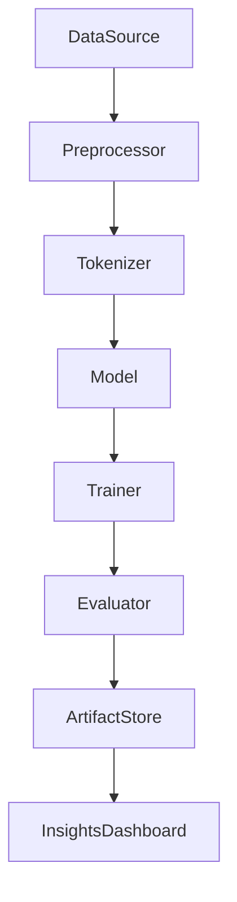

# DATA641-NLP-Homework-3
End-to-end NLP sentiment analysis project with configurable RNN variants (RNN, LSTM, BiLSTM) using PyTorch, including training, evaluation, and artifact generation.

## Quick Start
```bash
# 1) Create and activate a virtual environment
python3 -m venv venv
# macOS/Linux
source venv/bin/activate
# Windows
# venv\Scripts\activate

# 2) Upgrade pip
pip install --upgrade pip

# 3) Install dependencies
if [ -f requirements.txt ]; then
  pip install -r requirements.txt
else
  # Core dependencies if requirements.txt is not present
  pip install torch torchvision numpy pandas
fi

# 4) Run training (generates models, logs, artifacts)
python src/train.py

# 5) Run evaluation (uses trained models to produce metrics/reports)
python src/evaluate.py
```

Note: If a requirements.txt is available, prefer it. The core dependencies shown install PyTorch, NumPy, and pandas.

## Architecture


## Tech Stack
- Python 3
- PyTorch
- NumPy
- pandas
- pickle
- json

## Key Features
- Experimentation with RNN variants: RNN, LSTM, and BiLSTM with multiple activation and optimization options
- Modular ML pipeline: clear separation of preprocessing, modeling, and evaluation
- Reproducible artifacts: trained model checkpoints, interpretation reports, and evaluation metrics

